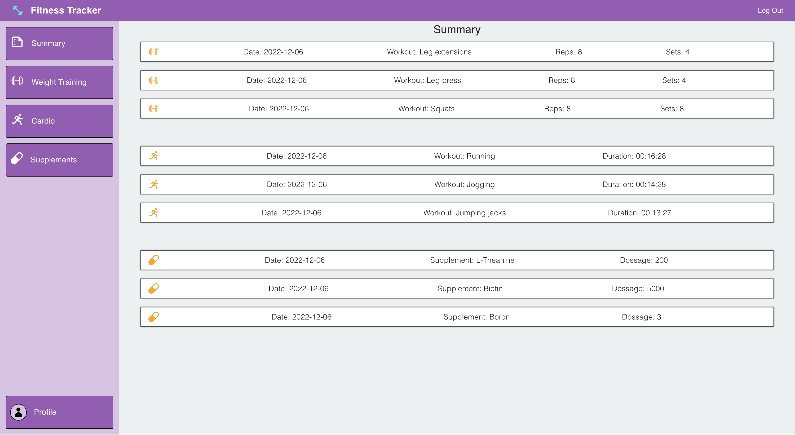
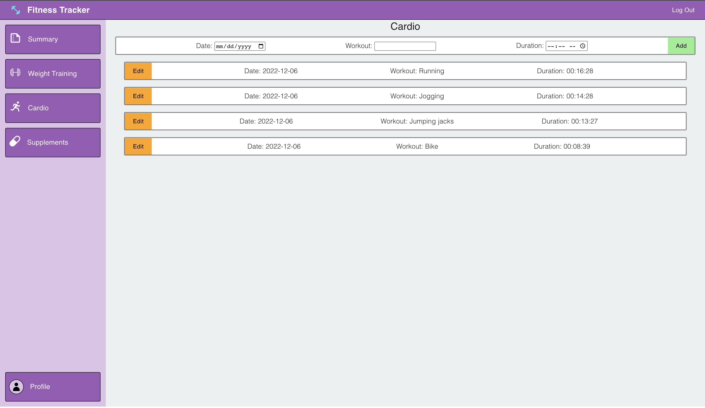
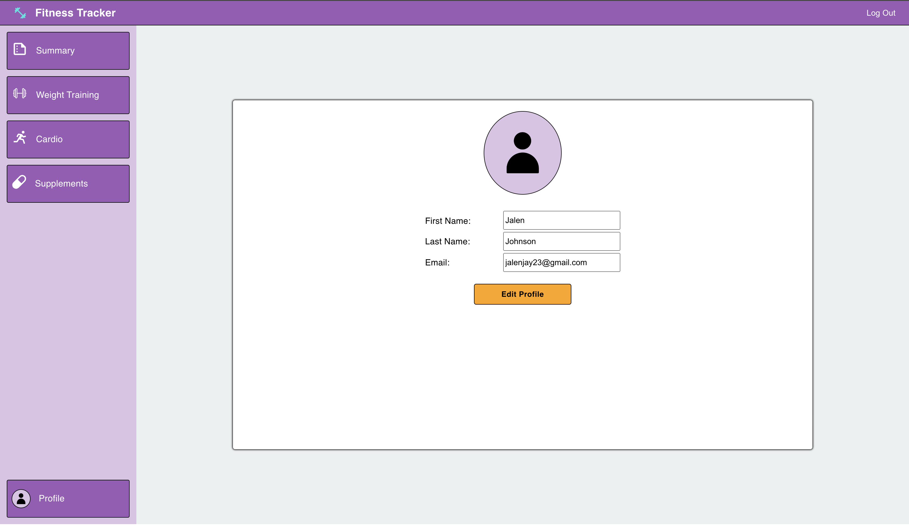

# Fitness Tracker Application

This application allows for users to track their fitness journey by logging:
<ul>
<li>Weight Training Sessions</li>
<li>Cardio</li>
<li>Supplements</li>
</ul>

<h2>Login Page</h2>
Users can login using their 
<ul>
<li>Email</li>
<li>Password</li>
</ul>

<h2>Summary Page</h2>
Summary page showcases the user's most recent:
<ul>
<li>Weight Training Sessions</li>
<li>Cardio Sessions</li>
<li>Supplementation</li>
</ul>

<h2>Weight Training Page</h2>
Weight Training page allows user to log:
<ul>
<li>Date</li>
<li>Specified Exercise</li>
<li>Avgerage Reps</li>
<li>Avgerage Sets</li>
</ul>

<h2>Cardio Page</h2>
Cardio page allows users to log:
<ul>
<li>Date</li>
<li>Specified Exercise</li>
<li>Exercise Duration</li>
</ul>

<h2>Supplements Page</h2>
Supplements page allows users to log:
<ul>
<li>Date</li>
<li>Specified Supplement</li>
<li>Supplement Dossage</li>
</ul>

<h2>Profile Page</h2>
Profile page allows users to view and edit their:
<ul>
<li>First Name</li>
<li>Last Name</li>
<li>Email</li>
<li>Password</li>
</ul>

